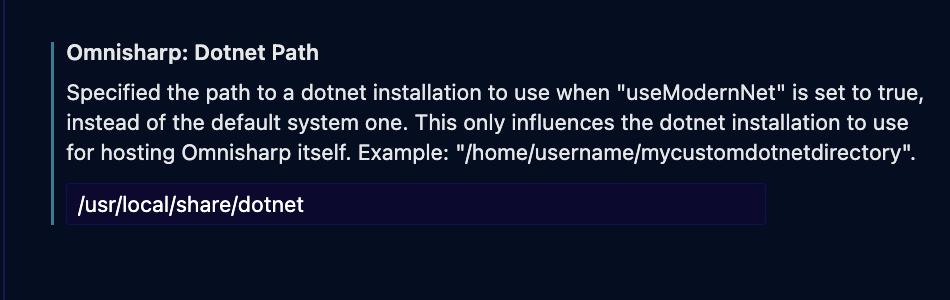
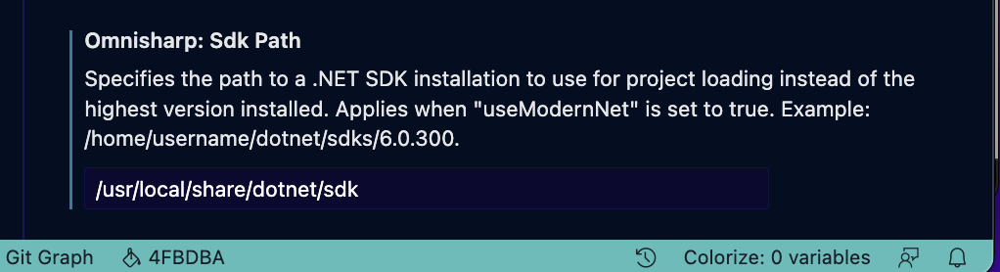

## VSCodeに出たエラー

``` text
The .NET Core SDK cannot be located: A valid dotnet installation could not be found. .NET Core debugging will not be enabled. Make sure the .NET Core SDK is installed and is on the path.
```

## 参考

- stack overflow: The .NET Core SDK cannot be located. .NET Core debugging will not be enabled. Make sure the .NET Core SDK is installed and is on the path
  - https://stackoverflow.com/questions/60712895/the-net-core-sdk-cannot-be-located-net-core-debugging-will-not-be-enabled-ma

## やったこと

1. Path調べる

調べる：
`dotnet --list-sdks`

結果：
``` shell
6.0.100 [/usr/local/share/dotnet/sdk]
6.0.400 [/usr/local/share/dotnet/sdk]
7.0.102 [/usr/local/share/dotnet/sdk]
```

2. VSCodeの設定をみる




3. `setting.json`に下記書かれているかチェック

``` json
"omnisharp.dotnetPath": "/usr/local/share/dotnet",
"omnisharp.sdkPath": "/usr/local/share/dotnet/sdk",
```
